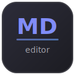

<p align="center">
  
</p>

<h1 align="center">EmDee Editor</h1>

<p align="center">A lightweight GTK markdown editor and viewer with a dark theme.</p>

## Features

- Split-pane editor with live preview
- Markdown syntax highlighting in the editor
- Formatting toolbar (bold, italic, headings, code, links, lists, blockquotes)
- Keyboard shortcuts (Ctrl+S, Ctrl+B, Ctrl+I, Ctrl+K, etc.)
- Table of contents sidebar with clickable heading navigation
- View mode toggle (Edit / Split / View)
- Save / Save As with unsaved changes protection
- Recent files menu (remembers last 10 files)
- Auto-reloads when the file changes on disk
- Dark themed rendered markdown with syntax-highlighted code blocks
- Opens `.md` files from app launcher or command line

## Install

```bash
git clone https://github.com/invisi101/emdee-editor.git
cd emdee-editor
chmod +x install.sh
./install.sh
```

This installs dependencies, copies the editor to `/usr/local/bin/emdee-editor`, and adds a `.desktop` file so it appears in your app launcher.

Supports Arch Linux, Debian/Ubuntu, and Fedora.

## Uninstall

```bash
./uninstall.sh
```

## Usage

Launch from your app launcher, or from the terminal:

```bash
emdee-editor              # Opens with welcome screen
emdee-editor file.md      # Opens a file directly
```

## Dependencies

- Python 3
- GTK 3
- WebKit2GTK 4.1
- GtkSourceView 4
- python-gobject
- python-markdown
- pygments

## License

MIT
