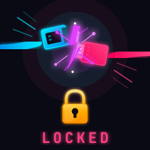

<p align="center">
  
</p>

> **LipCord** is a Linux port of [RipCord](https://github.com/kclose3/RipCord) by [KClose](https://github.com/kclose3). All credit for the original macOS implementation goes to them.

---

### LipCord - Automatically Lock & Suspend when USB Drive is Removed
&emsp;&emsp;v1.0

About this project:<br>
The intent of this project was to make a failsafe that would put a computer to sleep if someone were to steal the computer from someone sitting in public. This works by having a "key" drive that would be tethered to the user like a ripcord. If the computer were taken away forcefully, the USB drive would be removed and the computer will lock and suspend.

LipCord provides a simple GUI app with START and STOP buttons. When you press START, it confirms a USB drive labeled *LipCord* (case-insensitive) is connected, then begins monitoring. If the drive is removed, the computer immediately locks and suspends. Pressing STOP disarms the monitor so you can safely remove the drive.

If you close the app while monitoring is active, the monitor continues running in the background. Reopen the app at any time to stop it.

The USB drive does not need to be present at all times, only if you believe your computer might be at risk. Removing the USB drive locks and suspends the computer, but only upon initial removal after being inserted. If you unlock the computer after the drive has been removed, it will not lock again until the drive has been reinserted and removed again.

---

### Compatibility

LipCord works on any Linux system with systemd. It tries the following lock methods in order:

1. `loginctl lock-session` (systemd - works with most DEs and compositors)
2. D-Bus `org.freedesktop.ScreenSaver.Lock` (GNOME, KDE, XFCE, etc.)
3. Direct locker detection: hyprlock, swaylock, waylock, i3lock, xdg-screensaver, xscreensaver

Suspend is handled via `systemctl suspend`.

**Requirements:** Python 3 with [tkinter](https://docs.python.org/3/library/tkinter.html), a lightweight GUI toolkit included with Python on most systems. If it's not already installed, the install script will automatically install it for you. It can also be installed manually: `tk` on Arch, `python3-tk` on Debian/Ubuntu, `python3-tkinter` on Fedora.

---

This will install the following files:
- `~/.local/bin/lipcord` (GUI app)
- `~/.local/bin/lipcord-daemon` (background monitor)
- `~/.local/share/applications/lipcord.desktop` (app launcher entry)
- `~/.config/lipcord/config` (configuration)

To install LipCord:

```bash
git clone https://github.com/invisi101/LipCord.git
cd LipCord
./install.sh
```

Then rename a USB drive as *LipCord* and you're ready to go. Your screen locker should require a password on wake/unlock (this is the default for most Linux setups).

To use LipCord:
1. Launch **LipCord** from your app launcher or run `lipcord` in a terminal
2. Insert your *LipCord* USB drive
3. Click **START** to arm the monitor
4. Click **STOP** to disarm when you want to safely remove the drive

To uninstall LipCord:
1. Run `./uninstall.sh`
2. Or manually: delete the installed files listed above

---

### Configuration

Edit `~/.config/lipcord/config` to customize behavior:

- **LOCK** - Activates the lock screen, requiring your password to get back in. The computer stays fully on.
- **SUSPEND** - Puts the computer to sleep (like closing a laptop lid). RAM stays powered but everything else shuts down. When woken, the lock screen appears.

By default both are enabled. This means if someone grabs your laptop, it immediately sleeps *and* they hit a password prompt if they manage to wake it.

```bash
# Lock the session when LipCord USB is removed (yes/no)
LOCK=yes

# Suspend the system when LipCord USB is removed (yes/no)
SUSPEND=yes

# Polling interval in seconds
POLL_INTERVAL=1
```

---

ChangeLog
- 2026.03.27	-	v0.2.0 - GUI app with START/STOP, background daemon, case-insensitive USB detection
- 2026.03.27	-	v0.1.0 - Initial release (Linux port)

---

> [!IMPORTANT]
> ### REMINDER:
> **Don't forget to STOP the app from INSIDE THE GUI when you're done with it.** The monitor runs in the background even after closing the window. If you don't stop it first, removing the USB drive will lock and suspend your system.
